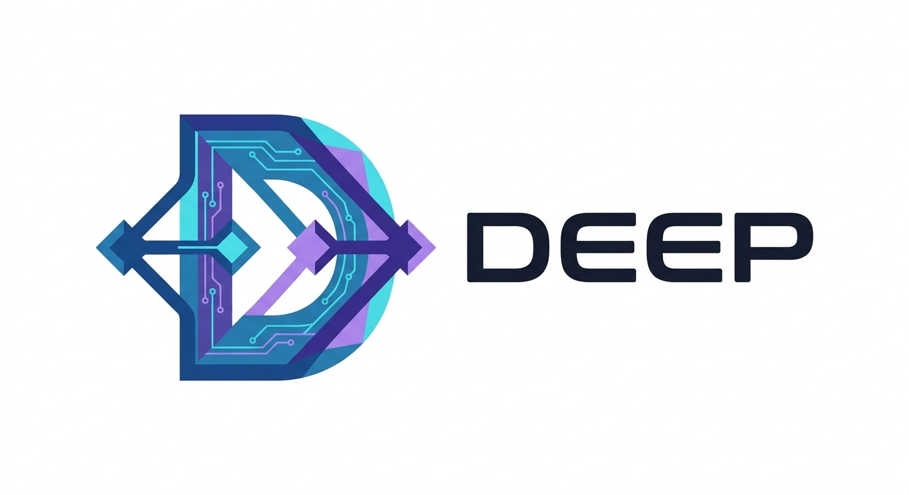

<p align="center">
  
</p>
<p align="center">
  <strong>A standalone version control system. No server required. No Git dependency.</strong><br>
  Pure Python · P2P-native · Crash-proof · 55+ commands · Zero external dependencies
</p>

<p align="center">
  <a href="LICENSE"></a>
  <a href="https://www.python.org/downloads/"></a>
  <a href="https://github.com/GalHillel/Deep/actions"></a>
  <a href="https://github.com/GalHillel/Deep/releases"></a>
  <a href="CONTRIBUTING.md"></a>
</p>

---

## Why Deep?

Git was designed in 2005 around assumptions that no longer hold: central servers are mandatory, CI/CD is someone else's problem, and content-addressable storage is a novelty. Deep is a ground-up rewrite — not a wrapper, not a shim — built for how developers actually work today.

One `pip install`. No C extensions. No `libgit2`. No shelling out to `git`.

---

## Feature Grid

| Category | Capability | Implementation |
|---|---|---|
| **Storage** | ACID-compliant writes | Every mutation passes through a Write-Ahead Log. Kill the process mid-commit — Deep recovers on next invocation. Zero data loss. |
| **Storage** | Content-Addressable Object Store | Blobs, Trees, Commits, Tags stored as `<type> <size>\0<content>`. SHA-1 addressed, zlib compressed, Level-2 fan-out. |
| **Storage** | Delta compression | Rabin-Karp rolling hash identifies shared blocks. Only diffs are stored. Packfiles use a sliding window for optimal ratios. |
| **Storage** | Content-Defined Chunking | Large files split at content-dependent boundaries (FastCDC-style). Move a function between files — Deep stores the chunk once. |
| **Network** | Native P2P sync | `deep p2p discover` finds peers via UDP multicast. HMAC-signed beacons. Zero-trust commit verification. No GitHub required. |
| **Network** | Smart Protocol | Full upload-pack / receive-pack over SSH and HTTPS. `multi_ack_detailed`, `side-band-64k`, thin packs. Push to GitHub without Git. |
| **Platform** | Embedded PR/Issue/CI | Pull Requests, Issues, CI/CD pipelines stored as JSON in `.deep/platform/`. Clone a repo, get the full project history. |
| **AI** | Intelligent automation | `deep ai suggest` generates commit messages from diffs. `deep ai review` runs automated code review. `deep ai predict-merge` forecasts conflicts. AST-level analysis, secret scanning, SemVer prediction. |
| **Security** | Cryptographic signing | HMAC-SHA256 commit signing, Merkle audit chains, encrypted keyring, key rotation and revocation. |
| **Security** | Sandboxed execution | Pipeline and batch scripts run in isolated subprocesses with restricted filesystem access. |
| **DX** | 55+ CLI commands | From `deep init` to `deep ultra`. Categorized help, ANSI colored output, `argparse`-based discoverability. |
| **DX** | Deep Studio | `deep studio` launches a local web dashboard: DAG visualization, file editor, PR management, real-time status. |
| **DX** | Plugin system | Drop a `.py` file into `.deep/plugins/` — it becomes a first-class CLI subcommand. |

---

## Quickstart

```bash
# Install globally (recommended)
pipx install git+https://github.com/GalHillel/Deep.git
```

```bash
# Create a repository
mkdir my-project && cd my-project
deep init
```

```bash
# Stage, commit, inspect
echo "hello" > README.md
deep add .
deep commit -m "first commit"
deep log --oneline
```

For system-wide installation options and contributor setup, see [docs/INSTALL.md](docs/INSTALL.md).

---

## Architecture (30-second version)

```
CLI (main.py)  ──→  Commands (*_cmd.py)  ──→  Core Engine (core/)
                                                    │
                                        ┌───────────┼───────────┐
                                    Storage/     Network/     Platform/
                                    objects.py   daemon.py    pr.py
                                    txlog.py     p2p.py       pipeline.py
                                    pack.py      smart_protocol.py
                                    index.py     transport.py
```

**Hard rule:** Commands → Core → Storage. Never skip a layer. Every layer is independently testable.

For the full deep-dive, read [docs/ARCHITECTURE.md](docs/ARCHITECTURE.md).

---

## Project Layout

```
src/deep/
├── cli/main.py           # 55+ subcommands, single-file argparse dispatcher
├── commands/             # One file per command (*_cmd.py → run(args))
├── core/                 # Business logic: merge, diff, refs, status, graph, stash, gc
│   ├── security.py       # HMAC signing, Merkle chains, sandbox, key management
│   ├── hooks.py          # pre-commit, pre-push, post-merge hook system
│   └── config.py         # INI-based config: local (.deep/config) + global (~/.deepconfig)
├── storage/              # CAS objects, WAL, packfiles, delta compression, index
│   ├── objects.py        # Blob/Tree/Commit/Tag + read/write pipeline + LRU cache
│   ├── txlog.py          # Write-Ahead Log with HMAC-signed entries
│   ├── pack.py           # PACK/DIDX packfile format (delta-compressed)
│   ├── chunking.py       # Content-Defined Chunking (FastCDC-style)
│   └── transaction.py    # ACID transaction manager with lock hierarchy
├── network/              # P2P, daemon, smart protocol, SSH/HTTPS transport
│   ├── p2p.py            # UDP multicast discovery, signed beacons, rate limiting
│   └── smart_protocol.py # Full upload-pack/receive-pack implementation
├── ai/                   # Rule-based AI: commit messages, code review, refactoring
│   ├── assistant.py      # AST-aware commit message generator, quality analyzer
│   ├── analyzer.py       # Diff semantics, secret scanning, complexity scoring
│   └── refactor.py       # Heuristic auto-refactoring engine
├── plugins/              # Runtime plugin discovery (.deep/plugins/*.py)
├── server/               # Platform HTTP API
└── web/                  # Deep Studio dashboard (HTML/JS SPA)
    ├── dashboard.py      # ThreadingHTTPServer with REST API
    └── services.py       # Service layer: status, graph, diff, PR, issue management
```

---

## Documentation

| Document | What it covers |
|---|---|
| [**Installation**](docs/INSTALL.md) | pipx, pip, editable installs, contributor setup |
| [**User Guide**](docs/USER_GUIDE.md) | Day-to-day workflows: branching, merging, syncing, stashing, undoing |
| [**CLI Reference**](docs/CLI_REFERENCE.md) | All 55+ commands grouped by category with flags and examples |
| [**Architecture**](docs/ARCHITECTURE.md) | Layer diagram, object model, WAL mechanics, ref system, merge engine |
| [**Internals**](docs/INTERNALS.md) | Byte-level object format, delta encoding, packfile structure, P2P gossip |
| [**Deep Studio**](docs/STUDIO.md) | Visual dashboard: DAG visualization, file editor, PR/Issue management |
| [**AI Features**](docs/AI_FEATURES.md) | Smart commit messages, code review, merge prediction, refactoring |
| [**Contributing**](CONTRIBUTING.md) | Setup, architecture rules, PR checklist, commit conventions |

---

## License

MIT — do whatever you want with it. See [LICENSE](LICENSE).

<p align="center">
  <sub>Built by <a href="https://github.com/GalHillel">@GalHillel</a></sub>
</p>