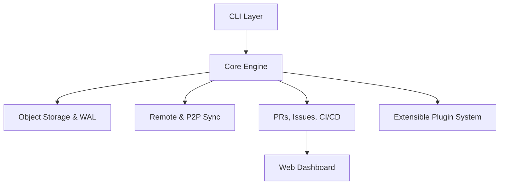

# Deep VCS — Next-Generation Distributed Version Control & Platform

Deep is a professional, production-grade distributed version control system (DVCS) and developer platform. It combines the reliability and familiarity of Git with advanced P2P synchronization, integrated CI/CD, and AI-powered intelligence.

[](LICENSE)
[](INSTALL.md)
[](https://github.com/GalHillel/Deep/graphs/commit-activity)

---

## 🚀 Key Features

-   **📡 Distributed P2P Sync**: Synchronize repositories over local networks and the internet without a central server.
-   **🏢 Integrated Platform**: Native support for Pull Requests, Issues, and CI/CD pipelines out of the box.
-   **💎 Crash-Safe Integrity**: High-performance storage with Write-Ahead Logging (WAL) and atomic transactions for rock-solid reliability.
-   **🤖 AI-Powered Intelligence**: Smart commit suggestions, automated code refactoring (`ultra`), and intelligent merge conflict prediction.
-   **🔒 Security-First**: Native GPG signing, RBAC permissions, and isolated sandbox execution for secure command processing.

## 🏗 System Architecture

Deep's modular architecture is designed for scale and extensibility, separating the core engine from storage and platform services.



[Read the full Architecture Guide →](docs/architecture.md) | [Analysis Report →](docs/analysis_report.md)

## 📦 Installation

To get started immediately:

```bash
# Clone and install in one command
git clone https://github.com/GalHillel/Deep.git
cd Deep && pip install -e .
```

For detailed instructions on various platforms and uninstallation, see [INSTALL.md](docs/INSTALL.md).

## 🛠 Quick Start

Initialize your first Deep repository and create your first commit in seconds:

```bash
# 1. Initialize a new repo
deep init

# 2. Stage your changes
deep add .

# 3. Create a commit (try --ai for a smart message!)
deep commit -m "Initial commit" --ai

# 4. Check your repository status
deep status
```

[Follow the full Quick Start Guide →](docs/quickstart.md)

## 🛠 Development & Testing

To set up a local development environment and run the test suite:

```bash
# 1. Install in editable mode
pip install -e .

# 2. Run the full test suite
pytest -vv tests/

# 3. Run specific test suites (e.g., storage, cli, network)
pytest -vv tests/storage
pytest -vv tests/cli
pytest -vv tests/network
```

[Read more about testing here →](docs/testing.md)

## 📖 Command Ecosystem

Deep provides a rich CLI experience with Git-compatible commands and powerful new additions.

-   **Core VCS**: `init`, `add`, `commit`, `log`, `status`, `diff`, `branch`, `checkout`, `merge`, `reset`
-   **Network**: `clone`, `push`, `pull`, `fetch`, `daemon`, `p2p`, `sync`, `remote`, `mirror`
-   **Platform**: `pr`, `issue`, `pipeline`, `web`, `server`, `auth`, `repo`, `user`
-   **Diagnostics**: `doctor`, `benchmark`, `audit`, `verify`, `rollback`, `gc`, `search`
-   **Intelligence**: `ai`, `ultra`, `batch`

[Explore the full Command Index →](docs/commands.md)

## 🤝 Contributing

We welcome contributions from the community! Whether you're fixing a bug, adding a feature, or improving documentation, please review our [Contributing Guidelines](CONTRIBUTING.md) to get started.

## 📄 License

Deep VCS is released under the **MIT License**. See the [LICENSE](LICENSE) file for the full text.

---

*“Deep is more than a tool; it’s the foundation for the next decade of modern software engineering.”*