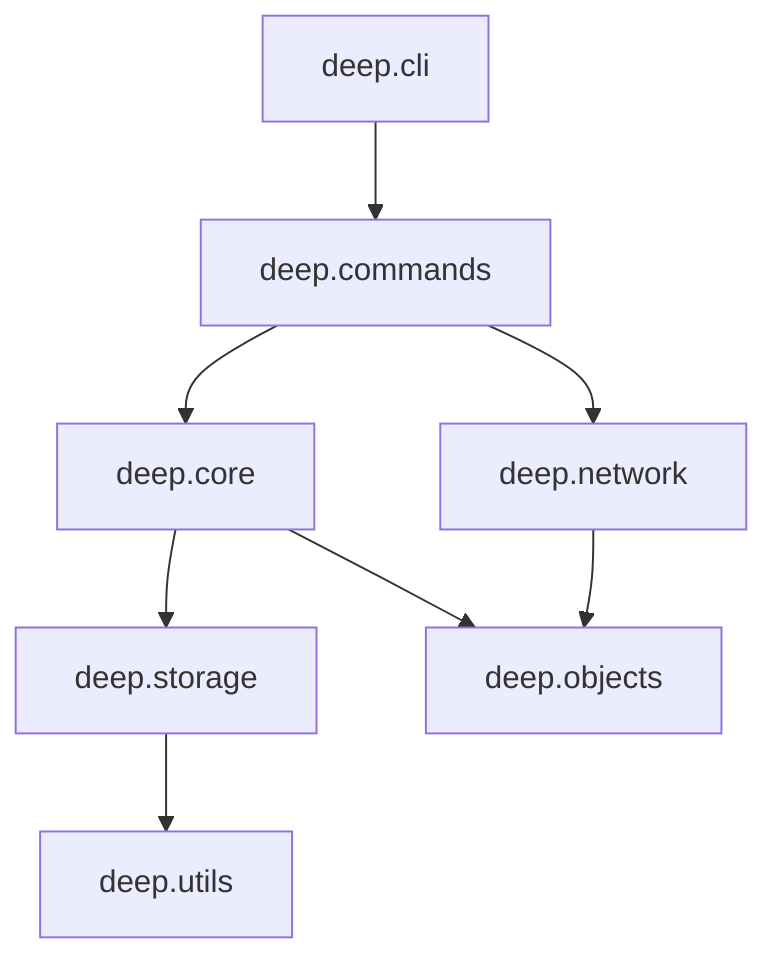
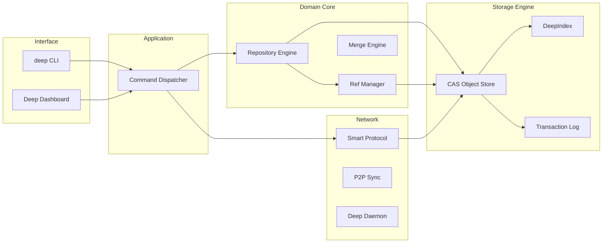

# DeepGit: Full-Deep Technical Analysis Report

## 1. Executive Summary
DeepGit is a next-generation distributed version control system (VCS) and developer platform built in Python. It provides a Git-compatible command-line interface while introducing advanced capabilities such as decentralized Peer-to-Peer (P2P) synchronization, AI-powered developer assistance, and integrated platform features (Issues, Pull Requests, Pipelines). The system is characterized by a layered architecture, a transactional storage engine, and a strong emphasis on security and auditability.

## 2. Project Purpose
The project aims to provide a robust, high-performance VCS that simplifies modern developer workflows. It bridges the gap between local version control and centralized collaborative platforms by embedding platform-level features directly into the VCS engine.

## 3. Architecture Overview
DeepGit follows a strictly layered modular architecture:

- **Interface Layer**: CLI (`deep.cli.main`) and Web Dashboard.
- **Command Dispatch Layer**: Decoupled command implementations (`deep.commands`).
- **Domain Layer**: Core VCS logic, repository management, and reference tracking (`deep.core`).
- **Object Model**: Git-compatible object types (Commit, Tree, Blob, Tag) (`deep.objects`).
- **Storage Layer**: Low-level persistence, indexing, packing, and transaction management (`deep.storage`).
- **Network Layer**: Support for various protocols (HTTPS, SSH, P2P) and background daemon processes (`deep.network`).
- **Extension Layer**: AI integrations and plugin system.

## 4. Folder Structure Explanation

### 📂 `src/deep` (Core Package)
The main source directory for the Deep VCS engine.

| Folder | Responsibility |
| :--- | :--- |
| `cli/` | Command-line interface orchestration and argument parsing. |
| `commands/` | Implementations for all `deep` CLI commands. |
| `core/` | Fundamental VCS logic: Repository lifecycle, Ref management, Merging, Diffing. |
| `storage/` | Data persistence: Object stores, index handling, packfiles, and transaction logs. |
| `objects/` | VCS data types and hash/integrity verification. |
| `network/` | Distributed synchronization: SSH/Smart protocols, P2P discovery, and daemon. |
| `ai/` | LLM-powered features: Commit msg generation, code analysis, and smart suggestions. |
| `server/` | Platform server components for hosting repositories and managing users. |
| `web/` | Visual dashboard and history browser. |
| `platform/` | Common platform definitions (User, PR, Issue models). |
| `plugins/` | Extensibility points for third-party integrations. |
| `utils/` | Shared utility functions (Logging, Path helpers, IO). |

### 📂 `tests/`
Full test suite including unit, integration, and end-to-end (E2E) tests.

### 📂 `docs/` & `scripts/`
Developer documentation and utility scripts for builds and maintenance.

## 5. Entry Points
- **Primary CLI**: `deep` (maps to `deep.cli.main:main`).
- **Network Daemon**: `deep daemon` (starts `network.daemon`).
- **Platform Server**: `deep server` (starts platform backend).
- **Web Interface**: `deep web` (launches local browser dashboard).
- **CI/CD Entry**: Integrated through `deep pipeline`.

## 6. File-Level Analysis (Phase 2)

A comprehensive audit of the core modules reveals a highly decoupled, layered architecture.

### 6.1 Core Module (`src/deep/core`)
| File | Responsibility | Role | Complexity |
| :--- | :--- | :--- | :--- |
| `repository.py` | Repo init, discovery, and high-level operations (checkout). | Core Engine | High |
| `refs.py` | Atomic reference management (HEAD, branches, tags). | Persistence | Moderate |
| `merge.py` | Recursive 3-way merge and LCA detection. | VCS Logic | High |
| `diff.py` | Textual and tree-based diffing algorithms. | VCS Logic | Moderate |
| `status.py` | Index/Worktree/HEAD status computation. | VCS Logic | Moderate |
| `locks.py` | Concurrency control via file-based locking. | Infrastructure | Low |
| `txlog.py` | Write-Ahead Log (WAL) for transactional safety. | Persistence | High |

### 6.2 Storage Module (`src/deep/storage`)
| File | Responsibility | Role | Complexity |
| :--- | :--- | :--- | :--- |
| `objects.py` | Content-addressable object store (Blob, Tree, Commit). | Database | Very High |
| `index.py` | Binary staging area (index) management. | Persistence | High |
| `pack.py` | Packfile and Index (.idx) reader/writer. | Optimization | High |
| `commit_graph.py` | Serialized commit graph for fast traversal. | Optimization | Moderate |
| `chunking.py` | Content-Defined Chunking for deduplication. | Optimization | High |

### 6.3 Network Module (`src/deep/network`)
| File | Responsibility | Role | Complexity |
| :--- | :--- | :--- | :--- |
| `smart_protocol.py` | Git-compatible negotiation and pack transfer. | Communication | High |
| `transport.py` | SSH and HTTPS socket/stream abstractions. | Infrastructure | Moderate |
| `p2p.py` | Decentralized discovery and synchronization. | Communication | Very High |
| `daemon.py` | Background service for repo hosting. | Infrastructure | Moderate |

### 6.4 Platform & AI Modules
| File/Folder | Responsibility | Role |
| :--- | :--- | :--- |
| `ai/` | LLM-powered assistance and code understanding. | Extension |
| `server/` | Multi-tenant repository hosting. | Platform |
| `pr.py` / `issue.py` | Embedded collaboration workflows. | Platform |

## 7. Class-by-Class Analysis (Phase 3)

### 7.1 `DeepObject` (and subclasses)
- **Hierarchy**: `DeepObject` → `Blob`, `Tree`, `Commit`, `Tag`.
- **Public API**: `serialize_content()`, `full_serialize()`, `sha`, `write(objects_dir)`.
- **Role**: Defines the immutable project data model.
- **Collaboration**: Written by `write_object`, read by `read_object`.

### 7.2 `SmartTransportClient`
- **Public API**: `ls_remote()`, `clone()`, `fetch()`, `push()`.
- **Logic**: Orchestrates negotiation, sideband demuxing, and packfile reception.
- **Collaboration**: Uses `SSHTransport` / `HTTPSTransport` and `PackfileParser`.

### 7.3 `Repository` (from `repository.py` logic)
- **Role**: Singleton-like manager for a local repo instance.
- **Logic**: Discovery, path resolution, and atomic state transitions (Checkout).
- **Safety**: Uses `RepositoryLock` to prevent concurrent corruption.

## 8. Function-Level Analysis (Phase 4)

### 8.1 `checkout(repo_root, target, ...)`
- **Logic**: 
    1. Acquire `RepositoryLock`.
    2. Resolve target (Branch/SHA).
    3. Check "Dirty State Invariant".
    4. Start WAL Transaction.
    5. Update Working Directory (Diff Index vs Target Tree).
    6. Update Ref (HEAD).
    7. Commit WAL.
- **Complexity**: O(N) where N is the number of files in the tree.

### 8.2 `read_object(objects_dir, sha)`
- **Logic**: 
    1. Check Local Cache.
    2. Try Loose Level 2 (`xx/yy/zz...`).
    3. Try Loose Level 1 (`xx/zz...`).
    4. Check Vault / Packfiles.
    5. Attempt P2P Fetch (if missing).
    6. Decompress and Deserialize.
    7. Handle Delta Reconstruction (Recursive up to depth 50).
- **Complexity**: O(D) where D is delta chain depth.

### 8.3 `recursive_merge(objects_dir, sha_a, sha_b)`
- **Logic**:
    1. Find all LCAs.
    2. If multiple, recursively merge LCAs into a virtual base.
    3. Perform 3-way tree merge against base.
- **Algorithm**: Recursive LCA / 3-Way Merge.

## 9. Data Flow Analysis (Phase 5)

Data moves through DeepGit in a clearly defined lifecycle:

### 9.1 Local State Change
1.  **Working Tree → Index (Stage)**: The `add` command calculates the SHA-1 of the file content, writes a **Blob** to the object store (if new), and updates the **DeepIndex** entry with the new hash and metadata.
2.  **Index → Object Store (Commit)**: The `commit` command traverses the index to build a **Tree** object (and sub-trees), writes them to the store, and creates a **Commit** object pointing to the root tree and parent commits.

### 9.2 Remote Synchronization
1.  **Object Store → Remote (Push)**: The `push` command identifies "missing" objects on the remote via ref discovery, builds a **Packfile** containing those objects, and streams it to the remote server/daemon.
2.  **Remote → Object Store (Fetch/Clone)**: The `fetch` command negotiates common ancestors, receives a packfile from the remote, and **unpacks** it into the local object store.

## 10. Control Flow Analysis (Phase 6)

### 10.1 Execution Sequence (CLI)
1.  **Initialization**: `deep.cli.main` builds the `argparse` parser.
2.  **Discovery**: `find_repo()` searches upwards for the `.deep` directory.
3.  **Dispatch**: The `command` string maps to a module in `deep.commands`.
4.  **Execution**: `module.run(args)` is invoked, typically instantiating a `Repository` or `SmartTransportClient`.

### 10.2 Background Operations
- **Deep Daemon**: A long-running process that listens for smart protocol requests via `network.daemon`.
- **Platform Server**: Orchestrates multi-tenant repository storage and API access for PRs/Issues.

## 11. Architecture Analysis (Phase 7)

### 11.1 Design Patterns
- **Content-Addressable Storage (CAS)**: Immutable data model where the hash is the identity.
- **Write-Ahead Logging (WAL)**: Transactions in `txlog.py` ensure ACID-like guarantees for repository operations.
- **Layered Architecture**: Strict separation between interface, domain logic, and persistence.
- **Provider Pattern**: Network transports (SSH/HTTPS) are interchangeable.

### 11.2 Coupling & Cohesion
- **High Cohesion**: Modules like `storage/objects.py` are exclusively dedicated to object lifecycle.
- **Low Coupling**: The CLI has zero knowledge of the underlying storage format; it interacts only through the `Repository` or `Command` interfaces.

## 12. Domain Logic (Phase 8)

### 12.1 Algorithms
- **Merge Engine**: Recursive 3-way merge with virtual base creation for criss-cross resolution.
- **Object Deduplication**: Implements both Delta Compression (VCDIFF) and Content-Defined Chunking (CDC).
- **Fast Traversal**: Uses a serialized `CommitGraph` for O(1) ancestor checks during negotiation.

## 13. Runtime Behavior (Phase 9)

- **Atomic Commits**: Repository state transitions are atomic; the `HEAD` ref is only updated *after* all objects and index entries are safely written and the WAL is committed.
- **Self-Healing**: The `read_object` logic can automatically quarantine corrupt objects and attempt recovery from network peers in a P2P configuration.

## 14. Dependency Graph (Phase 10)

## 15. Complexity Hotspots (Phase 11)

1.  **`network.smart_protocol`**: Extremely high cyclomatic complexity due to the stateful nature of the want/have negotiation and sideband demuxing.
2.  **`storage.objects`**: The recursive delta reconstruction logic is a critical performance path and potential bottleneck for very deep histories.
3.  **`core.merge`**: Non-trivial graph theory logic for LCA detection in complex DAG structures.

## 16. Risks

- **SHA-1 Collision**: While rare, the reliance on SHA-1 for object identity is a long-term cryptographic risk.
- **Global Locking**: The `RepositoryLock` in `locks.py` is a bottleneck for high-concurrency environments (e.g., automated build servers).
- **Delta Chain Depth**: While capped at 50, deep delta chains can still cause latency in object retrieval.

## 17. Suggested Improvements (Phase 12)

### 17.1 Architecture Improvements
- **Object Format Migration**: Implement support for SHA-256 (as Git has done) to provide future-proof cryptographic integrity.
- **Async I/O**: Transition critical storage paths to `asyncio` to improve performance during large packfile operations.

### 17.2 Refactor Suggestions
- **Modular Ref Resolution**: Extract the revision parsing logic from `refs.py` into a dedicated `RevisionParser` class for better testability.
- **Granular Locking**: Replace the global repository lock with a more granular system (e.g., per-ref locks) to allow concurrent reads during writes.

### 17.3 Performance Optimizations
- **In-Memory Cache**: Implement a global "Delta-Base Cache" to store recently reconstructed objects, significantly speeding up log and blame operations.
- **Parallel Unpacking**: Multi-thread the `unpack_to_store` logic to accelerate large clone/fetch operations.

## 18. Final Architecture Diagram

