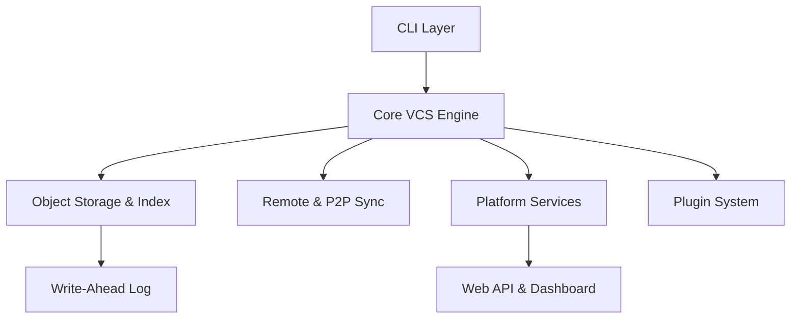

# Deep VCS Architecture Guide

Deep is a next-generation distributed version control system (DVCS) designed for speed, security, and extensibility. This document outlines the core architectural components and their interactions.

## High-Level Overview

Deep follows a strictly layered architecture with clean separation between the Command Line Interface (CLI), core VCS logic, object storage, and platform services.

## 1. Core VCS Engine (`deep.core`)

The engine manages high-level repository operations, reference management, and the commit lifecycle.

-   **Repository Management**: Handles discovery and initialization of `.deep` directories.
-   **Refs**: Manages branch names, tags, and the `HEAD` pointer. Uses a highly optimized key-value structure for mapping names to object SHAs.
-   **Commit Logic**: Orchestrates the transition from staging to permanent commit objects, ensuring tree structures are deduplicated and compressed.

## 2. Storage & Data Integrity (`deep.storage`)

Deep's storage layer is optimized for high integrity and atomic performance.

-   **Object Database**: A Content-Addressable Storage (CAS) system where objects (blobs, trees, commits) are identified by their SHA-1 hashes. 
-   **Stage (Index)**: A binary-encoded file that tracks the state of the working tree relative to the last commit. It uses memory-mapping (mmap) for high-performance reads and writes.
-   **Transaction Log (WAL)**: Deep implements a Write-Ahead Log to ensure atomicity. Every repository modification is first logged to the WAL, allowing for 100% reliable crash recovery and rollback capabilities.

## 3. Network & Distribution (`deep.network`)

Deep provides multiple ways to synchronize data, supporting both centralized and decentralized workflows.

-   **Standard Remote**: Supports HTTPS and local path synchronization (`clone`, `push`, `pull`).
-   **P2P Sync**: A decentralized discovery and synchronization engine that allows nodes to sync directly over a peer-to-peer network without requiring a central authority.
-   **Daemon**: A lightweight server for exposing local repositories over the network for fast collaboration.

## 4. Platform Ecosystem (`deep.platform`)

Beyond raw VCS, Deep includes built-in developer platform features integrated directly into the core.

-   **Pull Requests & Issues**: Native tracking of code reviews and work items stored within the repository metadata.
-   **CI/CD Pipelines**: Integrated pipeline runner that executes automated tasks defined in `.deepci.yml`, leveraging the internal VCS state for triggered builds.
-   **Auth & Permissions**: Secure token-based access control and Role-Based Access Control (RBAC) for platform-hosted repositories.

## 5. Security & Isolation (`deep.security`)

Security is a primary design constraint in Deep.

-   **GPG Signing**: Full support for cryptographically signing commits and tags to verify contributor identity.
-   **Sandboxed Execution**: CI/CD pipelines and the platform's internal command execution are isolated to prevent unauthorized system access.
-   **Audit Chaining**: Secret-key-backed audit logs provide a verifiable history of all sensitive repository actions.

## 6. Extensibility (`deep.plugins`)

The platform is designed to be extensible through a high-performance plugin architecture.

-   **Runtime Discovery**: Plugins are loaded at runtime, allowing for custom commands and hooks.
-   **Internal API**: A stable, documented internal API provides safe access to the VCS engine for community extensions.

---

*Deep is engineered for the next decade of software engineering, combining robust data structures with modern distributed patterns.*
